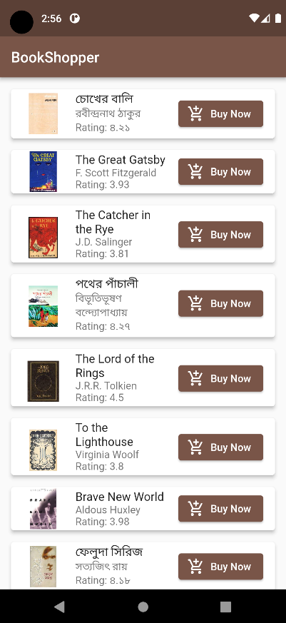

# BookShopper
### A Demo Book Store App Developed for CSE2100 Assignment 1

This repository contains the code for Assignment 1 of the CSE2100 course. It's an interactive book store app built using Flutter, showcasing various book details and ability to go back and forth between the pages.

## Features

- View a list of books with details like author, ratings, and descriptions.
- Navigate to a detailed view for each book to see high-resolution images and book details.
- Select delivery options and proceed to payment (dummy feature).
- Enjoy a user-friendly interface to browse through your favorite books.

## Screenshots

  
  
 
  

## Acknowledgements

This app was developed as part of CSE2100 coursework.
Acknowledge any additional resources used or inspirations received.
Book images were collected from GOOGLE and I do not own the images.
